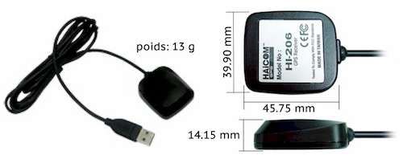

# gps-HI206.sh

Script Bash shell Linux/Unix destiné à donner la position GPS (en coordonnées type latitude / longitude) et la vitesse (en nœuds noté **kn**) selon un intervalle de temps donné en secondes utilisant le récepteur GPS Haicom HI-206-usb.

Le script requiert les lignes de commande suivantes:

* [gpsd et gpspipe](https://gpsd.io)
* [jq](https://jqlang.org)
* [gpp](https://logological.org/gpp)

## License
	
    This program is free software: you can redistribute it and/or modify
    it under the terms of the GNU General Public License as published by
    the Free Software Foundation, either version 3 of the License, or
    (at your option) any later version.

    This program is distributed in the hope that it will be useful,
    but WITHOUT ANY WARRANTY; without even the implied warranty of
    MERCHANTABILITY or FITNESS FOR A PARTICULAR PURPOSE.  See the
    GNU General Public License for more details.

    You should have received a copy of the GNU General Public License
    along with this program.  If not, see <http://www.gnu.org/licenses/>.

## GPS HAICOM HI-206-USB
GPS ultra-sensible / étanche / magnétique

**Livré avec :** un CD-ROM incluant le manuel d'utilisateur et un logiciel de test.

Le HI-206 USB est un récepteur GPS avec un connecteur USB et une antenne active intégrée haute sensibilité. Le GPS HI-206 USB est vraiment de petite taille et parfaitement adapté aux systèmes intégrés. Mais les utilisateurs peuvent également le connecter à un appareil mobile et l'utiliser avec un logiciel de cartographie et de navigation adapté pour la navigation.

* Récepteur GPS 20 canaux parallèles
* 4000 bins de recherche de fréquence simultanés
* SBAS (compatible WAAS/EGNOS)
* Sensibilité de suivi -159 dBm
* Démarrage à chaud : < 8 secondes
* Démarrage à froid : < 40 secondes

Le GPS Hi-206 est ultra-sensible pour l'acquisition des satellites avec ses 20 canaux parallèles. Le récepteur poursuit en continu les satellites en vue et fournit une position précise. Le GPS Hi-206 est optimisé pour des applications nécessitant de bonnes performances, un faible coût et une flexibilité maximale. Il est adapté à de nombreuses applications OEM comme les appareils portables, les capteurs, les systèmes de navigation...

Ses 20 canaux parallèles et ses 4000 bins de recherche fournissent une acquisition rapide du signal et un temps de démarrage rapide. Une sensibilité de tracking de -159 dBm offre une bonne performance de navigation même dans les canyons urbains ayant une vue limitée du ciel.

Les systèmes basés sur les satellites augmentant les capacités, comme WAAS et EGNOS, sont supportés pour une meilleure précision.

Le signal LVTTL-level et le signal RS232-level d'interface série sont fournis par l'interface du connecteur. La tension d'alimentation est de 3.3V ou 3.6V~7V (Typ. 5V).

### Spécifications techniques

* Puce GPS3F : SiRF StarIII
* Fréquence : L1, 1575.42 MHz
* C/A Code : 1.023 MHz chip rate
* Précision Position :
	* 10 mètres 2D RMS
	* 5 mètres 2D RMS avec correction WAAS
* Précision Vitesse : 0,1 m/s
* Précision temps : 1 microseconde synchronisé sur le temps GPS
* Datum par défaut : WGS84, autres datum sélectionables
* Réacquisition : 0,1 seconde, moyenne
* Altitude : 18000 mètres max.
* Vitesse : 515 m/s (1000 knots) max.
* Accélération : 4 g max.
* Alimentation principale : 5 V DC
* Consommation : 0,15 W (mode continu)
* Courant d'alimentation : 45 mA
* Alimentation de secours : pile 3 V rechargeable Lithium-Ion
* LED allumée : Recherche du signal
* LED clignotante : position acquise

--

    
